# SoftRenderer 软件渲染器 —— 完整渲染管线笔记

> **项目简介**：基于 [tinyrenderer](https://github.com/ssloy/tinyrenderer) 教程的 CPU 软件渲染器。
> 不依赖任何图形 API（OpenGL / Vulkan / DirectX），所有渲染计算均在 CPU 上完成，最终输出 TGA 格式图像。

---

## 目录

1. [项目架构总览](#1-项目架构总览)
2. [数学基础 —— geometry.h](#2-数学基础--geometryh)
3. [图像基础设施 —— TGAImage](#3-图像基础设施--tgaimage)
4. [模型加载 —— OBJ 解析](#4-模型加载--obj-解析)
5. [渲染管线核心 —— renderer](#5-渲染管线核心--renderer)
6. [坐标变换全流程](#6-坐标变换全流程)
7. [三角形光栅化与重心坐标](#7-三角形光栅化与重心坐标)
8. [透视校正插值](#8-透视校正插值)
9. [Z-Buffer 深度测试](#9-z-buffer-深度测试)
10. [Shader 架构与 IShader 接口](#10-shader-架构与-ishader-接口)
11. [Shadow Mapping 阴影映射（两遍渲染）](#11-shadow-mapping-阴影映射两遍渲染)
12. [Phong 光照模型](#12-phong-光照模型)
13. [切线空间法线贴图（Tangent-Space Normal Mapping）](#13-切线空间法线贴图tangent-space-normal-mapping)
14. [SSAO 屏幕空间环境光遮蔽](#14-ssao-屏幕空间环境光遮蔽)
15. [主程序执行流程](#15-主程序执行流程)
16. [完整渲染管线流程图](#16-完整渲染管线流程图)
17. [关键数据结构总结](#17-关键数据结构总结)

---

## 1. 项目架构总览

### 文件结构

```
SoftRenderer/
├── main.cpp              # 入口：阴影 Pass、Phong 渲染、SSAO 后处理
├── renderer.h / .cpp     # 渲染核心：MVP 矩阵构建、光栅化、Z-Buffer
├── geometry.h            # 数学库：Vec2/3/4、Matrix、旋转矩阵、求逆
├── Model.h / .cpp        # OBJ 模型加载：顶点、法线、UV、纹理
├── tgaimage.h / .cpp     # TGA 图像读写（帧缓冲 + 纹理容器）
├── obj/                  # 模型资产（.obj + 贴图）
├── Note/                 # 学习笔记
└── CMakeLists.txt        # CMake 构建配置（C++20 + OpenMP）
```

### 模块依赖关系

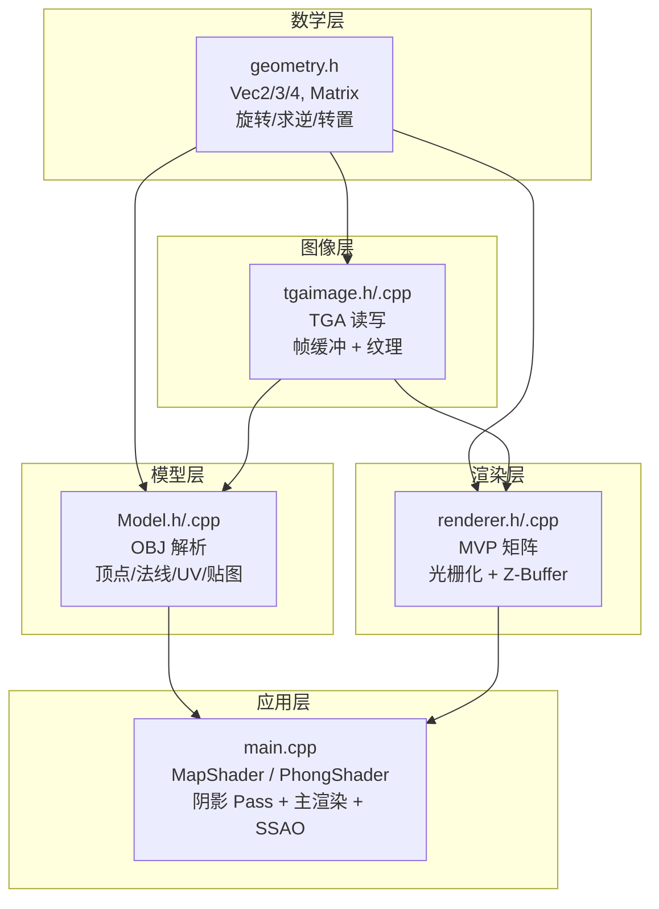

---

## 2. 数学基础 —— geometry.h

`geometry.h` 是整个渲染器的数学基础，提供了向量和矩阵运算的所有工具。

### 2.1 向量类型

| 类型 | 别名 | 说明 |
|------|------|------|
| `Vec2<T>` | `Vec2i`, `Vec2f` | 二维向量，用于纹理坐标 (u, v) |
| `Vec3<T>` | `Vec3i`, `Vec3f` | 三维向量，用于位置、法线、颜色 |
| `Vec4<T>` | `Vec4i`, `Vec4f` | 四维向量，用于齐次坐标 |

#### Vec3 核心运算

```cpp
Vec3f a(1, 2, 3), b(4, 5, 6);

a + b;          // 向量加法  → (5, 7, 9)
a - b;          // 向量减法  → (-3, -3, -3)
a * 2.f;        // 标量乘法  → (2, 4, 6)
a * b;          // 点积(内积) → 1×4 + 2×5 + 3×6 = 32
a ^ b;          // 叉积(外积) → (2×6-3×5, 3×4-1×6, 1×5-2×4) = (-3, 6, -3)
a.norm();       // 长度       → √(1²+2²+3²) = √14
a.normalize();  // 原地归一化
```

#### Vec4 与齐次坐标

```cpp
Vec3f p(1, 2, 3);
Vec4f v4(p);        // 从 Vec3 构造，默认 w=1（表示"点"）
Vec4f v4d(p, 0);    // w=0（表示"方向向量"，不受平移影响）

v4.xyz();           // 直接截取前三分量 → Vec3f(1, 2, 3)
v4.toVec3();        // 透视除法 → (x/w, y/w, z/w)
```

**为什么需要齐次坐标？**
- w=1 时表示"点"，4×4 矩阵的平移列会生效
- w=0 时表示"方向"，平移不生效（方向没有位置）
- 透视投影后 w≠1，需要做 `÷w` (透视除法) 才能回到 3D 空间

### 2.2 矩阵类型

```cpp
template <size_t ROWS, size_t COLS, typename T>
struct Matrix {
    std::array<std::array<T, COLS>, ROWS> m{};  // 行主序存储
    
    // 矩阵乘法：ROWS×COLS × COLS×C2 → ROWS×C2
    template <size_t C2>
    Matrix<ROWS, C2, T> operator*(const Matrix<COLS, C2, T>& other) const;
    
    Matrix<COLS, ROWS, T> transpose() const;  // 转置
    T det() const;                             // 行列式（仅方阵）
};
```

| 别名 | 类型 | 用途 |
|------|------|------|
| `Mat2` | `Matrix<2,2,float>` | 2×2 矩阵（UV 变换等） |
| `Mat3` | `Matrix<3,3,float>` | 3×3 矩阵（面积计算、2D 旋转） |
| `Mat4` | `Matrix<4,4,float>` | 4×4 矩阵（MVP 变换） |

### 2.3 矩阵求逆（高斯-约当消元法）

```cpp
template <size_t N, typename T>
Matrix<N, N, T> inverse(const Matrix<N, N, T>& mat) {
    Matrix<N, N, T> inv = identity_matrix<N, T>();  // 初始化为单位阵
    Matrix<N, N, T> a = mat;                         // 拷贝原矩阵

    for (size_t i = 0; i < N; ++i) {
        // 1. 选主元：在当前列找绝对值最大的行
        size_t pivot = i;
        for (size_t r = i + 1; r < N; ++r)
            if (std::abs(a.m[r][i]) > std::abs(a.m[pivot][i]))
                pivot = r;
        
        if (std::abs(a.m[pivot][i]) < 1e-6) return {};  // 奇异矩阵
        
        // 2. 交换行
        std::swap(a.m[pivot], a.m[i]);
        std::swap(inv.m[pivot], inv.m[i]);
        
        // 3. 归一化主元行
        T pivotVal = a.m[i][i];
        for (size_t c = 0; c < N; ++c) {
            a.m[i][c] /= pivotVal;
            inv.m[i][c] /= pivotVal;
        }
        
        // 4. 消元：用主元行消去其他行
        for (size_t r = 0; r < N; ++r) {
            if (r == i) continue;
            T factor = a.m[r][i];
            for (size_t c = 0; c < N; ++c) {
                a.m[r][c] -= factor * a.m[i][c];
                inv.m[r][c] -= factor * inv.m[i][c];
            }
        }
    }
    return inv;
}
```

### 2.4 旋转矩阵工厂

```cpp
Mat4 rotation_x(float angle);   // 绕 X 轴旋转
Mat4 rotation_y(float angle);   // 绕 Y 轴旋转
Mat4 rotation_z(float angle);   // 绕 Z 轴旋转
Mat4 rotation_axis(Vec3f axis, float angle);  // 绕任意轴旋转（Rodrigues 公式）
Mat3 rotation_2d(float angle);  // 2D 旋转
```

以绕 Z 轴旋转为例：

$$
R_z(\theta) = \begin{bmatrix} \cos\theta & -\sin\theta & 0 & 0 \\ \sin\theta & \cos\theta & 0 & 0 \\ 0 & 0 & 1 & 0 \\ 0 & 0 & 0 & 1 \end{bmatrix}
$$

---

## 3. 图像基础设施 —— TGAImage

`TGAImage` 在项目中扮演双重角色：

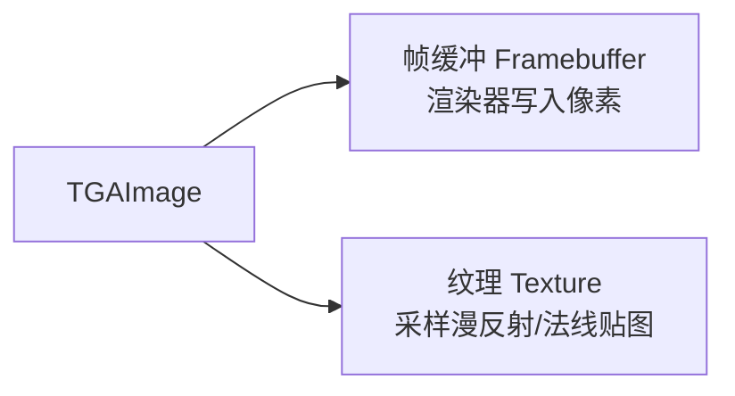

### 3.1 TGA 文件格式

TGA 文件结构极其简单，非常适合教学：

```
┌──────────────────┐
│ TGA Header (18B) │ ← 固定 18 字节文件头
├──────────────────┤
│ Pixel Data       │ ← 像素数据（未压缩 or RLE）
├──────────────────┤
│ Footer (26B)     │ ← TGA 2.0 尾部标识
└──────────────────┘
```

**文件头结构（18 字节，`#pragma pack(1)` 保证紧凑）：**

```cpp
#pragma pack(push,1)
struct TGAHeader {
    uint8_t  idlength = 0;        // 图像 ID 长度（通常 0）
    uint8_t  colormaptype = 0;    // 调色板类型（0=无）
    uint8_t  datatypecode = 0;    // 数据类型：2=未压缩RGB, 3=灰度, 10=RLE-RGB, 11=RLE-灰度
    uint16_t colormaporigin = 0;
    uint16_t colormaplength = 0;
    uint8_t  colormapdepth = 0;
    uint16_t x_origin = 0;
    uint16_t y_origin = 0;
    uint16_t width = 0;           // 图像宽度
    uint16_t height = 0;          // 图像高度
    uint8_t  bitsperpixel = 0;    // 每像素位数（8/24/32）
    uint8_t  imagedescriptor = 0; // bit5=垂直方向, bit4=水平方向
};
#pragma pack(pop)
```

### 3.2 像素颜色 TGAColor

```cpp
struct TGAColor {
    uint8_t bgra[4] = {0,0,0,0};  // 注意是 BGRA 顺序！不是 RGBA
    uint8_t bytespp = 4;           // 每像素字节数
};
```

**为什么是 BGRA？** 这是 TGA 格式的历史遗留，TGA 规范定义像素顺序就是 BGR(A)。

```
白色 = {255, 255, 255, 255}   → B=255, G=255, R=255, A=255
红色 = {  0,   0, 255, 255}   → B=0,   G=0,   R=255, A=255
```

### 3.3 核心操作：get() 和 set()

这是整个渲染管线最终的读写操作：

```cpp
// 读取像素（纹理采样）
TGAColor TGAImage::get(const int x, const int y) const {
    if (!data.size() || x<0 || y<0 || x>=w || y>=h) return {};  // 越界保护
    TGAColor ret = {0, 0, 0, 0, bpp};
    const uint8_t *p = data.data() + (x + y * w) * bpp;  // 内存寻址
    for (int i=bpp; i--; ret.bgra[i] = p[i]);
    return ret;
}

// 写入像素（光栅化输出）
void TGAImage::set(int x, int y, const TGAColor &c) {
    if (!data.size() || x<0 || y<0 || x>=w || y>=h) return;  // 越界保护
    memcpy(data.data() + (x + y * w) * bpp, c.bgra, bpp);     // 直接内存拷贝
}
```

**内存布局**（以 3×2 RGB 图像为例）：

```
data 数组：[pixel(0,0) | pixel(1,0) | pixel(2,0) | pixel(0,1) | pixel(1,1) | pixel(2,1)]
偏移公式：offset = (x + y × width) × bpp
```

### 3.4 RLE 压缩/解压

TGA 支持 RLE（Run-Length Encoding）无损压缩：

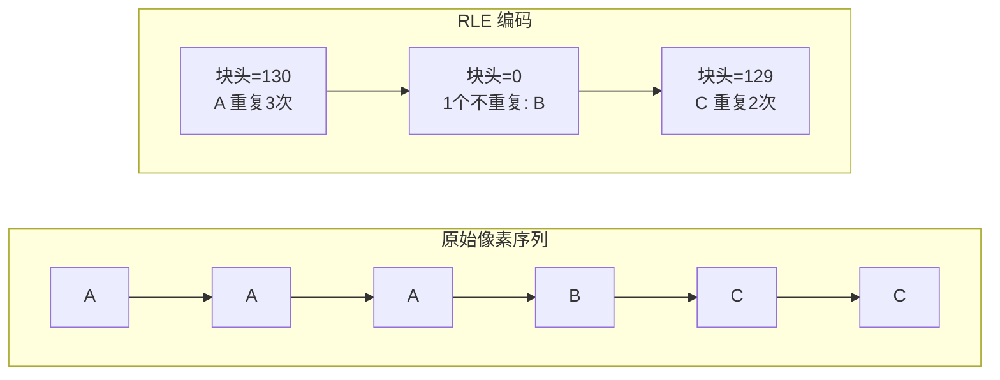

- **块头 < 128**（RAW 块）：后面跟 `块头+1` 个不重复像素
- **块头 ≥ 128**（RLE 块）：后面跟 1 个像素，重复 `块头-127` 次

---

## 4. 模型加载 —— OBJ 解析

### 4.1 OBJ 文件格式

OBJ 是一种纯文本 3D 模型格式，每行一条数据：

```
v  -0.5 0.0 0.5        # 顶点坐标 (x, y, z)
vt  0.25 0.75           # 纹理坐标 (u, v)
vn  0.0 1.0 0.0         # 法线方向 (nx, ny, nz)
f  1/1/1 2/2/2 3/3/3    # 面：v索引/vt索引/vn索引（1-based）
```

### 4.2 Model 类

```cpp
class Model {
private:
    std::vector<Vec3f> verts_;       // 顶点坐标
    std::vector<Vec3f> norms_;       // 法线
    std::vector<Vec2f> uvs_;         // 纹理坐标
    std::vector<std::vector<int>> faces_;       // 面 → 顶点索引
    std::vector<std::vector<int>> face_norms_;  // 面 → 法线索引
    std::vector<std::vector<int>> face_uvs_;    // 面 → UV 索引
    TGAImage diffusemap_;            // 漫反射贴图
    TGAImage normalmap_;             // 法线贴图
};
```

### 4.3 OBJ 解析流程

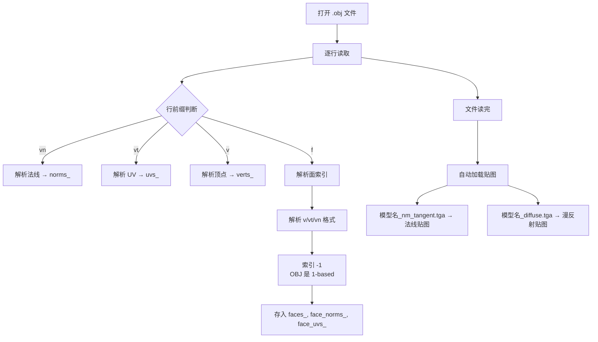

**面索引解析关键代码：**

```cpp
// 支持多种 OBJ 格式：v, v/vt, v/vt/vn, v//vn
for (int i = 0; i < 3; i++) {
    int vidx, vtidx = 0, vnidx = 0;
    iss >> vidx;                    // 读顶点索引
    if (iss.peek() == '/') {
        iss >> trash;               // 吃掉 '/'
        if (iss.peek() == '/') {    // v//vn 格式
            iss >> trash >> vnidx;
        } else {                    // v/vt 或 v/vt/vn
            iss >> vtidx;
            if (iss.peek() == '/') {
                iss >> trash >> vnidx;
            }
        }
    }
    f.push_back(vidx - 1);         // OBJ 是 1-based，转为 0-based
    fn.push_back(vnidx - 1);
    fuv.push_back(vtidx - 1);
}
```

### 4.4 法线贴图采样

法线贴图存储的是切线空间法线，RGB 通道映射到 XYZ：

```cpp
Vec3f Model::normal(Vec2f uv) const {
    TGAColor c = normalmap_.get(uv.x * normalmap_.width(), uv.y * normalmap_.height());
    Vec3f res;
    for (int i = 0; i < 3; i++)
        res[2 - i] = c[i] / 255.f * 2.f - 1.f;  // [0,255] → [-1, 1]
    return res;
}
```

注意 `res[2 - i]`：因为 TGA 是 BGRA 顺序，需要反转索引将 BGR → RGB → XYZ。

---

## 5. 渲染管线核心 —— renderer

### 5.1 全局状态

```cpp
// renderer.h / renderer.cpp
Mat4 modelview;            // 模型-视图变换矩阵
Mat4 perspective;          // 透视投影矩阵
Mat4 viewport;             // 视口变换矩阵
std::vector<float> zbufferf;  // 深度缓冲（全局，大小 = width × height）
```

### 5.2 三大变换矩阵构建函数

#### ModelView（LookAt 相机变换）

将世界空间转换到相机（眼睛）空间：

```cpp
void ModelView(const Vec3f eye, const Vec3f center, const Vec3f up) {
    Vec3f n = (eye - center).normalize();  // 相机看向 -z 方向
    Vec3f l = (up ^ n).normalize();        // 右方向
    Vec3f m = (n ^ l).normalize();         // 真正的上方向
    
    // 旋转矩阵：将世界坐标系旋转到相机坐标系
    Mat4 rot;
    rot[0] = {l.x, l.y, l.z, 0};   // 右方向 → x 轴
    rot[1] = {m.x, m.y, m.z, 0};   // 上方向 → y 轴
    rot[2] = {n.x, n.y, n.z, 0};   // 视线反方向 → z 轴
    rot[3] = {0,   0,   0,   1};
    
    // 平移矩阵：将 center 移到原点
    Mat4 trans;
    trans[0] = {1, 0, 0, -center.x};
    trans[1] = {0, 1, 0, -center.y};
    trans[2] = {0, 0, 1, -center.z};
    trans[3] = {0, 0, 0, 1};
    
    modelview = rot * trans;  // 先平移，再旋转
}
```

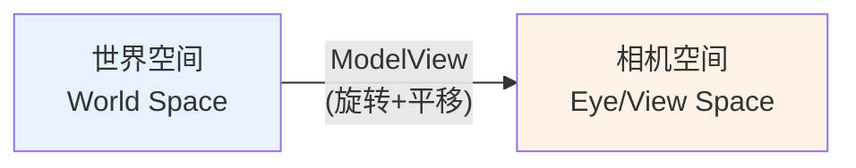

**LookAt 矩阵构建示意：**

```
eye = 相机位置
center = 观察目标点
up = 世界上方向

n = normalize(eye - center)    → 相机 z 轴（看向 -z）
l = normalize(up × n)          → 相机 x 轴（右方向）
m = n × l                      → 相机 y 轴（真正上方向）

        ┌ l.x  l.y  l.z  0 ┐   ┌ 1  0  0  -cx ┐
MV =    │ m.x  m.y  m.z  0 │ × │ 0  1  0  -cy │
        │ n.x  n.y  n.z  0 │   │ 0  0  1  -cz │
        └ 0    0    0    1 ┘   └ 0  0  0   1  ┘
```

#### Perspective（透视投影）

```cpp
void Perspective(float f) {
    //     ┌ 1  0   0    0 ┐
    //     │ 0  1   0    0 │
    // P = │ 0  0   1    0 │
    //     └ 0  0  -1/f  1 ┘
    perspective[0] = {1, 0, 0, 0};
    perspective[1] = {0, 1, 0, 0};
    perspective[2] = {0, 0, 1, 0};
    perspective[3] = {0, 0, -1/f, 1};
}
```

这不是标准的 OpenGL 透视矩阵，而是一个简化版本：
- `f = ‖eye - center‖`（焦距 = 眼睛到目标的距离）
- 变换后 `w' = -z/f + 1`，越远的物体 w 越大，`x/w` 和 `y/w` 就越小 → **近大远小**

#### Viewport（视口变换）

将 NDC 坐标 `[-1, 1]` 映射到屏幕像素坐标：

```cpp
void Viewport(int x, int y, int w, int h) {
    //           ┌ w/2   0   0  x+w/2 ┐
    //           │  0   h/2  0  y+h/2 │
    // viewport= │  0    0   1    0   │
    //           └  0    0   0    1   ┘
    viewport[0] = {w/2.f, 0,     0, x+w/2.f};
    viewport[1] = {0,     h/2.f, 0, y+h/2.f};
    viewport[2] = {0,     0,     1, 0};
    viewport[3] = {0,     0,     0, 1};
}
```

映射关系：`x_screen = x_ndc × w/2 + (x + w/2)`

---

## 6. 坐标变换全流程

一个顶点从模型空间到屏幕空间的完整变换链：

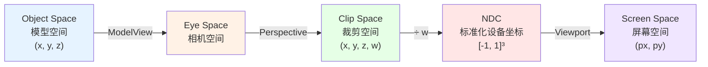

**在代码中的体现（Vertex Shader）：**

```cpp
// PhongShader::Vertex()
Vec4f v = {model->vert(model->face(face)[vert]), 1};  // 模型空间 → Vec4 齐次坐标

// 保存相机空间坐标（用于光照计算）
tri[vert] = modelview * v;                              // → 相机空间

// 输出裁剪空间坐标（用于光栅化）
return perspective * modelview * v;                      // → 裁剪空间
```

**在光栅化器中的后续变换：**

```cpp
// Rasterize() 内部
// 裁剪空间 → NDC（透视除法）
Vec4f ndc[3] = {
    Vec4f(face[0].x/face[0].w, face[0].y/face[0].w, face[0].z/face[0].w, 1),
    // ...
};

// NDC → 屏幕空间（视口变换）
for (int i=0; i<3; i++)
    ndc[i] = viewport * ndc[i];
```

---

## 7. 三角形光栅化与重心坐标

### 7.1 光栅化流程

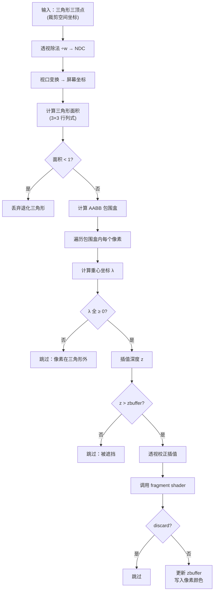

### 7.2 重心坐标计算

本项目使用 **矩阵方法** 而非常见的面积比方法来计算重心坐标：

```cpp
// 构建 3×3 矩阵：每行是一个顶点的 (x, y, 1)
Mat3 area;
area[0] = {screen[0].x, screen[0].y, 1};
area[1] = {screen[1].x, screen[1].y, 1};
area[2] = {screen[2].x, screen[2].y, 1};

float triangleArea = area.det();  // 行列式 = 三角形面积的2倍（带符号）
if (triangleArea < 1) return;     // 面积太小，丢弃

// 对于每个像素 (x, y)：
Vec3f heavyPoint = invert_transpose(area) * Vec3f(x, y, 1);
```

**原理**：设三角形三顶点为 A、B、C，对于三角形内部任意点 P(x,y)，存在重心坐标 (λ₁, λ₂, λ₃) 使得：

$$
\begin{bmatrix} A_x & A_y & 1 \\ B_x & B_y & 1 \\ C_x & C_y & 1 \end{bmatrix}^T
\begin{bmatrix} \lambda_1 \\ \lambda_2 \\ \lambda_3 \end{bmatrix}
= \begin{bmatrix} x \\ y \\ 1 \end{bmatrix}
$$

所以 $\lambda = (M^T)^{-1} \cdot P = (M^{-1})^T \cdot P$ = `invert_transpose(area) * Vec3f(x, y, 1)`

如果 λ₁、λ₂、λ₃ 都 ≥ 0，则点在三角形内部。

### 7.3 完整光栅化代码

```cpp
void Rasterize(TGAImage &img, const Vec4f face[3], const IShader &shader) {
    // 1. 透视除法：裁剪空间 → NDC
    Vec4f ndc[3] = {
        Vec4f(face[0].x/face[0].w, face[0].y/face[0].w, face[0].z/face[0].w, 1),
        Vec4f(face[1].x/face[1].w, face[1].y/face[1].w, face[1].z/face[1].w, 1),
        Vec4f(face[2].x/face[2].w, face[2].y/face[2].w, face[2].z/face[2].w, 1),
    };
    
    // 2. 视口变换：NDC → 屏幕坐标
    for (int i=0; i<3; i++)
        ndc[i] = viewport * ndc[i];
    
    Vec2f screen[3] = { /* 提取 xy */ };
    
    // 3. 计算三角形面积（行列式法）
    Mat3 area;
    area[0] = {screen[0].x, screen[0].y, 1};
    area[1] = {screen[1].x, screen[1].y, 1};
    area[2] = {screen[2].x, screen[2].y, 1};
    float triangleArea = area.det();
    if (triangleArea < 1) return;  // 退化三角形或背面
    
    // 4. AABB 包围盒
    auto [minxx, maxxx] = std::minmax({screen[0].x, screen[1].x, screen[2].x});
    auto [minyy, maxyy] = std::minmax({screen[0].y, screen[1].y, screen[2].y});
    int minx = std::max((int)minxx, 0);
    int maxx = std::min((int)maxxx, img.width()-1);
    int miny = std::max((int)minyy, 0);
    int maxy = std::min((int)maxyy, img.height()-1);
    
    // 5. 逐像素遍历（OpenMP 加速）
    #pragma omp parallel for
    for (int x = minx; x <= maxx; x++) {
        for (int y = miny; y <= maxy; y++) {
            // 6. 重心坐标
            Vec3f heavyPoint = invert_transpose(area) * Vec3f(x, y, 1);
            if (heavyPoint.x < 0 || heavyPoint.y < 0 || heavyPoint.z < 0) continue;
            
            // 7. 深度插值 + Z-buffer 测试
            float z = heavyPoint * Vec3f{ndc[0].z, ndc[1].z, ndc[2].z};
            if (z <= zbufferf[x + y * img.width()]) continue;
            
            // 8. 透视校正插值
            Vec3f bar = Vec3f(
                heavyPoint.x / face[0].w,
                heavyPoint.y / face[1].w,
                heavyPoint.z / face[2].w
            );
            bar = bar / (bar.x + bar.y + bar.z);  // 重新归一化
            
            // 9. 调用 Fragment Shader
            auto [discard, color] = shader.fragment(bar);
            if (discard) continue;
            
            // 10. 更新深度缓冲 + 写入颜色
            zbufferf[x + y * img.width()] = z;
            img.set(x, y, color);
        }
    }
}
```

---

## 8. 透视校正插值

### 8.1 为什么需要透视校正？

在透视投影下，屏幕空间的线性插值 **不等于** 世界空间的线性插值。

```
         近平面                远平面
  相机 ────┬──────────────────────┬────
           │   ╱                  │
           │  ╱  三角形            │
           │ ╱                    │
           │╱                     │
```

近处的一半三角形在屏幕上占据了更多面积，如果直接在屏幕空间线性插值纹理坐标，近处的纹理会被压缩，远处的被拉伸。

### 8.2 校正公式

设屏幕空间重心坐标为 (λ₁, λ₂, λ₃)，三顶点的齐次 w 分量为 w₁, w₂, w₃：

$$
\bar{\lambda}_i = \frac{\lambda_i / w_i}{\sum_j \lambda_j / w_j}
$$

**代码实现：**

```cpp
// heavyPoint = 屏幕空间重心坐标
// face[i].w  = 裁剪空间 w 值（与深度成正比）

Vec3f bar = Vec3f(
    heavyPoint.x / face[0].w,   // λ₁ / w₁
    heavyPoint.y / face[1].w,   // λ₂ / w₂
    heavyPoint.z / face[2].w    // λ₃ / w₃
);
bar = bar / (bar.x + bar.y + bar.z);  // 归一化
```

这样得到的 `bar` 就是透视校正后的重心坐标，用它来插值 UV、法线等属性就不会出现扭曲。

---

## 9. Z-Buffer 深度测试

### 9.1 原理

Z-Buffer 是一个与屏幕同尺寸的浮点数组，存储每个像素当前最近物体的深度值。

```cpp
std::vector<float> zbufferf;  // 大小 = width × height
zbufferf.assign(width * height, -1e10f);  // 初始化为"无穷远"
```

### 9.2 测试逻辑

```cpp
float z = heavyPoint * Vec3f{ndc[0].z, ndc[1].z, ndc[2].z};  // 插值深度
if (z <= zbufferf[x + y * width]) continue;  // 被前面的物体遮挡
zbufferf[x + y * width] = z;                 // 更新为更近的深度
```

> **约定**：本项目中 z 值越大越近（相机在 +z 方向），所以 `z > zbuffer` 表示"更近"。

### 9.3 深度缓冲可视化

```cpp
TGAImage CreateZBufferImage(const std::vector<float>& zbufferf, int width, int height) {
    // 找到有效深度的最小最大值
    float zmin = FLT_MAX, zmax = -FLT_MAX;
    for (int i = 0; i < width * height; i++) {
        if (zbufferf[i] > -1e9f) {
            zmin = std::min(zmin, zbufferf[i]);
            zmax = std::max(zmax, zbufferf[i]);
        }
    }
    // 线性映射到 [0, 255] 灰度
    TGAImage zimg(width, height, TGAImage::GRAYSCALE);
    for (int x = 0; x < width; x++)
        for (int y = 0; y < height; y++) {
            float z = zbufferf[x + y * width];
            uint8_t val = (uint8_t)((z - zmin) / (zmax - zmin) * 255);
            zimg.set(x, y, TGAColor{val});
        }
    return zimg;
}
```

---

## 10. Shader 架构与 IShader 接口

### 10.1 IShader 接口

本项目模拟 GPU 的 Shader 模型，定义了抽象基类：

```cpp
class IShader {
public:
    // Fragment Shader：对每个像素计算颜色
    // 返回 {discard, color}：discard=true 表示丢弃此像素
    virtual std::pair<bool, TGAColor> fragment(const Vec3f bar) const = 0;

    // 工具函数：纹理采样
    static TGAColor sample2D(const TGAImage &img, const Vec2f &uvf) {
        return img.get(uvf[0] * img.width(), uvf[1] * img.height());
    }
};
```

### 10.2 Shader 执行模型

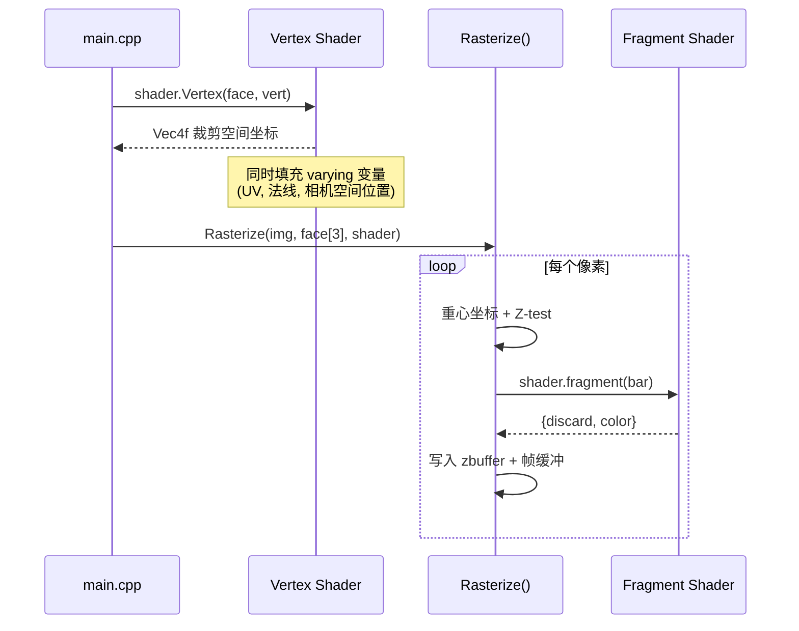

**注意**：Vertex Shader（`Vertex()` 方法）是在 `main()` 中手动调用的，不在 `Rasterize()` 内部。`Rasterize()` 只负责光栅化 + 调用 Fragment Shader。

### 10.3 两个 Shader 实现

| Shader | 用途 | Vertex 输出 | Fragment 计算 |
|--------|------|------------|---------------|
| `MapShader` | Shadow Pass（第一遍） | 裁剪空间坐标 | 不计算颜色，只更新 zbuffer |
| `PhongShader` | 主渲染（第二遍） | 裁剪空间坐标 + UV + 法线 + 相机空间位置 | Phong 光照 + 法线贴图 + 阴影 |

---

## 11. Shadow Mapping 阴影映射（两遍渲染）

### 11.1 原理

Shadow Mapping 的核心思想：**从光源视角看不到的地方，就是阴影**。

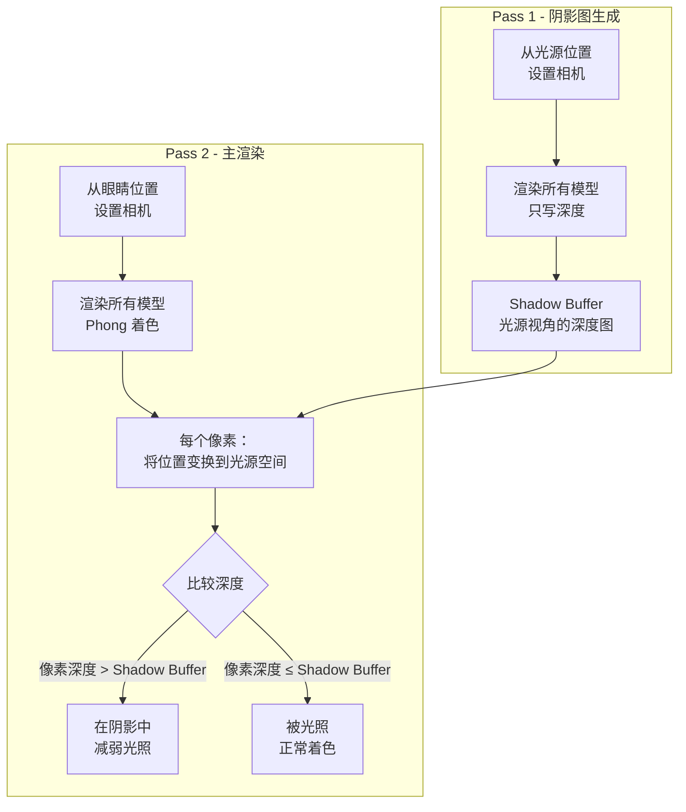

### 11.2 Pass 1：生成阴影贴图

```cpp
// 从光源位置建立 MVP
ModelView(light, center, up);
Perspective((light - center).norm());
Viewport(width/16, height/16, width * 7/8, height * 7/8);

Mat4 M_Light = viewport * perspective * modelview;  // 光源空间的完整变换
zbufferf.assign(width * height, -1e10f);             // 清空深度缓冲

// 用 MapShader 只写深度，不计算颜色
for (int m = 0; m < model_count; m++) {
    MapShader shadowShader(&models[m]);
    for (int i = 0; i < models[m].nfaces(); i++) {
        Vec4f face[3] = {
            shadowShader.Vertex(i, 0),
            shadowShader.Vertex(i, 1),
            shadowShader.Vertex(i, 2)
        };
        Rasterize(shadowImg, face, shadowShader);  // 内部自动更新 zbufferf
    }
}
std::vector<float> shadowBuffer = zbufferf;  // 保存光源视角的深度图
```

`MapShader` 的 Fragment Shader 直接返回 `{false, 黑色}`，因为我们只关心深度：

```cpp
virtual std::pair<bool, TGAColor> fragment(const Vec3f bar) const {
    TGAColor color{0,0,0,0};
    return {false, color};  // 不丢弃，但不关心颜色
}
```

### 11.3 Pass 2：阴影比较

**关键变换矩阵**：将相机空间坐标变换到光源屏幕空间。

```cpp
// M_Shadow = 光源完整变换 × 相机 ModelView 的逆
// 效果：相机空间 → 世界空间 → 光源屏幕空间
Mat4 M_Shadow = M_Light * inverse(modelview);
```

变换链：
```
相机空间坐标 → (inverse(modelview)) → 世界空间 → (M_Light) → 光源屏幕空间
```

**在 Fragment Shader 中进行阴影比较：**

```cpp
// 将当前像素从相机空间变换到光源屏幕空间
Vec4f p_view = tri[0] * bar.x + tri[1] * bar.y + tri[2] * bar.z;  // 相机空间位置
Vec4f p_light = M_shadow * p_view;   // 变换到光源空间
p_light = p_light / p_light.w;        // 透视除法

float shadow_diff = 1.f;  // 默认：不在阴影中
float shadow_spec = 1.f;
float bias = 0.05f;        // 偏移量，防止自阴影（Shadow Acne）

// 边界检查 + 深度比较
if (p_light.x >= 0 && p_light.x < shadow_width &&
    p_light.y >= 0 && p_light.y < shadow_height) {
    int shadow_idx = (int)p_light.x + (int)p_light.y * shadow_width;
    if (p_light.z + bias < shadowBuffer[shadow_idx]) {
        shadow_diff = 0.05f;  // 在阴影中：漫反射大幅降低
        shadow_spec = 0.f;    // 在阴影中：高光完全消失
    }
}
```

### 11.4 Shadow Bias（深度偏移）

```
                 ╱ 光线
                ╱
    ┌──────────╱──────────┐
    │  表面    ╱           │  ← 像素的实际深度可能因精度误差
    │         ╱  略大于     │    略大于 Shadow Buffer 中的值
    │        ╱   Shadow    │    导致自己"遮住自己"（Shadow Acne）
    └───────╱─── Buffer ───┘
```

`bias = 0.05f` 就是给当前深度加一个小偏移，避免自阴影伪影。

---

## 12. Phong 光照模型

### 12.1 三个分量

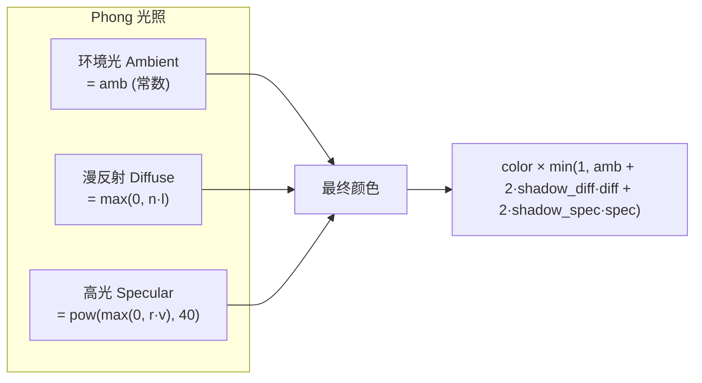

### 12.2 光照计算代码

```cpp
// 在 PhongShader::fragment() 中：

double amb = 0.35;                          // 环境光系数（保底亮度）
double diff = std::max(0.f, n * l);         // 漫反射：法线与光线方向的点积
Vec3f v_dir = -p_view.toVec3().normalize(); // 视线方向（从像素指向相机）
double spec = std::pow(std::max(0.f, r * v_dir), 40);  // 高光：反射方向与视线的40次幂

for (int i = 0; i < 3; i++) {
    color[i] *= std::min(1., amb + 2 * shadow_diff * diff + shadow_spec * 2 * spec);
}
```

### 12.3 光照向量说明

```
        n (法线)
        ↑
        │   ╱ r (反射方向)
        │  ╱
        │ ╱
        │╱
 ───────●──────── 表面
       ╱│
      ╱  │
     ╱   │
    l     v_dir
 (光线方向)  (视线方向)
```

- **l** = 光线方向（已变换到相机空间并归一化）
- **n** = 表面法线（从法线贴图采样并变换）
- **r** = 反射方向：`r = n × (n·l × 2) - l`
- **v_dir** = 视线方向：`-normalize(p_view)`（相机在原点，所以视线 = -位置）

### 12.4 反射方向计算

$$
\vec{r} = 2(\vec{n} \cdot \vec{l})\vec{n} - \vec{l}
$$

```cpp
Vec3f r = (n * (n*l*2.f) - l).normalize();
```

---

## 13. 切线空间法线贴图（Tangent-Space Normal Mapping）

### 13.1 为什么需要法线贴图？

低面数模型的表面法线是平的，光照看起来很假。法线贴图为每个像素提供不同的法线方向，模拟细节凹凸。

### 13.2 TBN 矩阵构建

法线贴图存储的是切线空间法线（Tangent Space），需要用 **TBN 矩阵** 变换到相机空间。

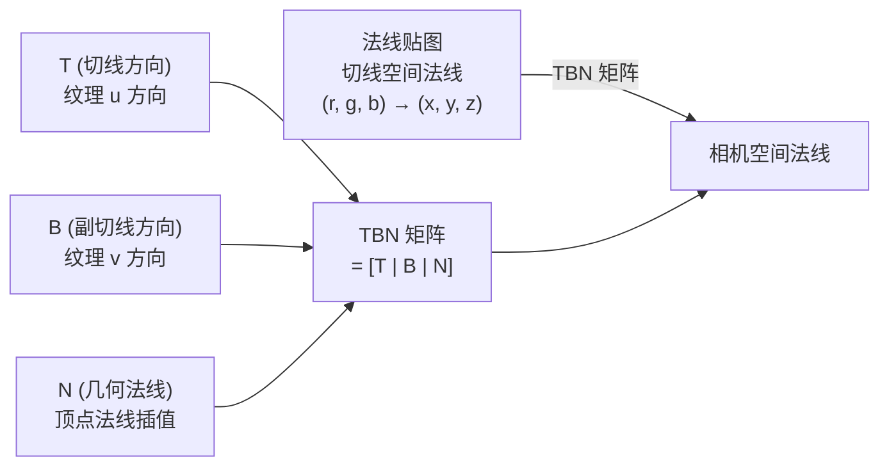

**构建步骤（在 PhongShader::fragment 中）：**

```cpp
// 1. 构建边向量矩阵 E（相机空间）
Matrix<2,4, float> E;
Vec4f e0 = tri[1] - tri[0];   // 三角形边1
Vec4f e1 = tri[2] - tri[0];   // 三角形边2
E[0] = {e0.x, e0.y, e0.z, e0.w};
E[1] = {e1.x, e1.y, e1.z, e1.w};

// 2. 构建 UV 差分矩阵
Matrix<2,2,float> U;
Vec2f u0 = varying_uv[1] - varying_uv[0];
Vec2f u1 = varying_uv[2] - varying_uv[0];
U[0] = {u0.x, u0.y};
U[1] = {u1.x, u1.y};

// 3. 求解 T 和 B：T = U⁻¹ × E
Matrix<2,4,float> T_matrix = inverse(U) * E;
```

**数学原理**：

设三角形三顶点为 P₀, P₁, P₂，对应 UV 为 (u₀,v₀), (u₁,v₁), (u₂,v₂)，则：

$$
\begin{bmatrix} \Delta u_1 & \Delta v_1 \\ \Delta u_2 & \Delta v_2 \end{bmatrix}
\begin{bmatrix} T \\ B \end{bmatrix}
= \begin{bmatrix} E_1 \\ E_2 \end{bmatrix}
$$

其中 $E_1 = P_1 - P_0$, $E_2 = P_2 - P_0$。解出 T 和 B 就得到了切线和副切线方向。

### 13.3 正交化处理（Gram-Schmidt）

```cpp
// 插值几何法线
Vec3f a2 = varying_normal[0] * bar.x + varying_normal[1] * bar.y + varying_normal[2] * bar.z;
a2.normalize();

// Gram-Schmidt 正交化：确保 T ⊥ N
Vec3f t = {T_matrix[0][0], T_matrix[0][1], T_matrix[0][2]};
t = t - a2 * (t * a2);     // 减去 N 方向的分量
t.normalize();

// 确保 B ⊥ N 且 B ⊥ T
Vec3f b = {T_matrix[1][0], T_matrix[1][1], T_matrix[1][2]};
b = b - a2 * (b * a2);     // 减去 N 方向的分量
b = b - t * (b * t);       // 减去 T 方向的分量
b.normalize();

// 组装 TBN 矩阵
Mat4 A;
A[0] = {t.x, t.y, t.z, 0};   // T
A[1] = {b.x, b.y, b.z, 0};   // B
A[2] = {a2.x, a2.y, a2.z, 0}; // N
A[3] = {0, 0, 0, 1};
```

### 13.4 应用法线贴图

```cpp
// 从贴图采样切线空间法线
Vec2f uv = varying_uv[0]*bar.x + varying_uv[1]*bar.y + varying_uv[2]*bar.z;
Vec3f n_tangent = model->normal(uv);  // 从法线贴图采样

// 切线空间 → 相机空间
Vec3f n = (A * Vec4f(n_tangent, 0)).toVec3().normalize();
```

---

## 14. SSAO 屏幕空间环境光遮蔽

### 14.1 原理

SSAO（Screen-Space Ambient Occlusion）是一种后处理效果，模拟缝隙和凹角处的环境光遮蔽。

**核心思想**：对于每个像素，在其周围随机采样若干点，检查有多少邻居比自己"更近相机"。邻居越多越近 → 说明被围在凹处 → 遮蔽越强 → 越暗。

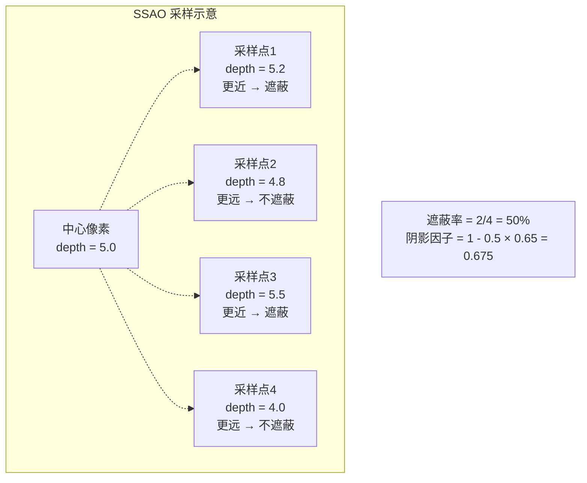

### 14.2 完整实现

```cpp
void ApplySSAO(TGAImage &img, const std::vector<float> &zbuffer, int width, int height) {
    std::default_random_engine generator(2026);  // 固定种子，保证渲染稳定
    std::uniform_real_distribution<float> random_floats(0.0, 1.0);

    #pragma omp parallel for
    for (int y = 0; y < height; y++) {
        for (int x = 0; x < width; x++) {
            float center_z = zbuffer[x + y * width];
            if (center_z < -1e9f) continue;  // 背景，跳过

            float total_occlusion = 0.0f;
            int sample_count = 16;   // 每像素 16 个采样
            float radius = 15.0f;     // 采样半径（像素）

            for (int i = 0; i < sample_count; i++) {
                // 随机方向和距离
                float angle = random_floats(generator) * 2.0f * M_PI;
                float r = random_floats(generator) * radius;
                
                int sample_x = x + (int)(r * cos(angle));
                int sample_y = y + (int)(r * sin(angle));
                
                // 越界检查
                if (sample_x < 0 || sample_x >= width || 
                    sample_y < 0 || sample_y >= height) continue;

                float neighbor_z = zbuffer[sample_x + sample_y * width];
                
                // 核心判断：邻居更近（z更大） → 说明被遮挡
                if (neighbor_z > center_z) {
                    float depth_diff = neighbor_z - center_z;
                    if (depth_diff < 15.0f) {  // 深度差阈值，防止远处物体误遮蔽
                        total_occlusion += 1.0f;
                    }
                }
            }

            // 计算遮蔽因子
            float occlusion_factor = total_occlusion / (float)sample_count;
            float shadow_factor = 1.0f - occlusion_factor * 0.65f;  // 0.65 = 遮蔽强度

            // 涂黑：原始颜色 × 遮蔽因子
            TGAColor color = img.get(x, y);
            for (int c = 0; c < 3; c++)
                color[c] = (int)(color[c] * shadow_factor);
            img.set(x, y, color);
        }
    }
}
```

### 14.3 关键参数

| 参数 | 值 | 含义 |
|------|-----|------|
| `sample_count` | 16 | 采样数量，越多质量越好越慢 |
| `radius` | 15.0 | 采样半径（像素），决定遮蔽范围大小 |
| `depth_diff` 阈值 | 15.0 | 防止远处不相关物体误遮蔽 |
| 遮蔽强度 | 0.65 | 控制暗化程度，值越大阴影越重 |

---

## 15. 主程序执行流程

### 15.1 完整执行时序

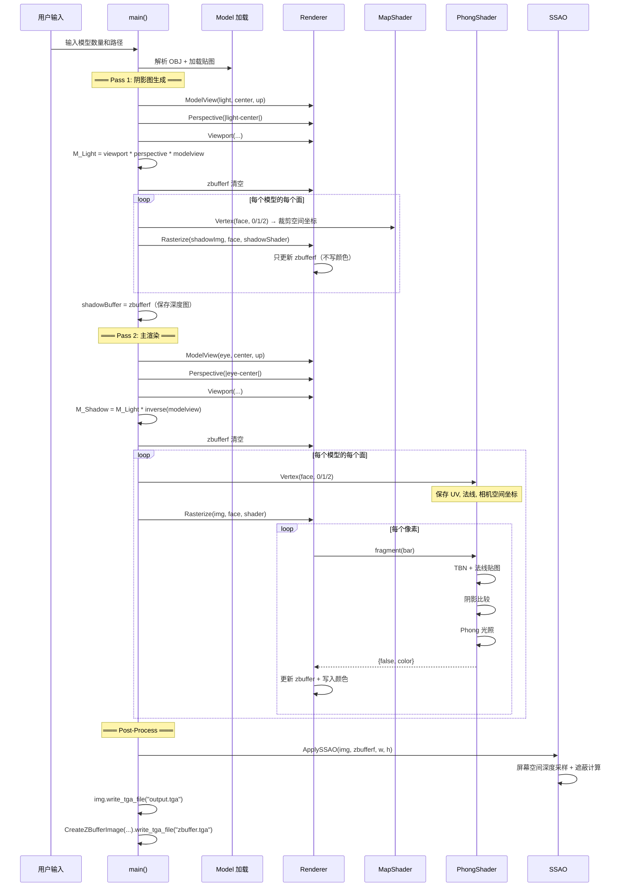

### 15.2 main() 代码结构

```cpp
int main() {
    // ========== 1. 加载模型 ==========
    int model_count;
    std::cin >> model_count;
    std::vector<Model> models;
    for (...) models.emplace_back(paths[i]);
    
    int width = 1080, height = 1080;
    Vec3f light(0.5, 1, 1);    // 光源方向
    Vec3f eye(-1, 0, 2);       // 相机位置
    Vec3f center(0, 0, 0);     // 观察目标
    Vec3f up(0, 1, 0);         // 世界上方向

    // ========== 2. Pass 1: Shadow Map ==========
    ModelView(light, center, up);
    Perspective((light - center).norm());
    Viewport(width/16, height/16, width*7/8, height*7/8);
    Mat4 M_Light = viewport * perspective * modelview;
    zbufferf.assign(width * height, -1e10f);
    
    for (每个模型的每个面)
        MapShader → Rasterize → 只写深度
    
    std::vector<float> shadowBuffer = zbufferf;

    // ========== 3. Pass 2: 主渲染 ==========
    TGAImage img(width, height, TGAImage::RGB, {177, 195, 209, 255});  // 浅蓝灰背景
    
    ModelView(eye, center, up);
    Perspective((eye - center).norm());
    Viewport(width/16, height/16, width*7/8, height*7/8);
    Mat4 M_Shadow = M_Light * inverse(modelview);
    zbufferf.assign(width * height, -1e10f);
    
    for (每个模型的每个面)
        PhongShader → Rasterize → 完整光照着色

    // ========== 4. 后处理 ==========
    ApplySSAO(img, zbufferf, width, height);
    
    // ========== 5. 输出 ==========
    img.write_tga_file("output.tga");
    CreateZBufferImage(zbufferf, width, height).write_tga_file("zbuffer.tga");
}
```

---

## 16. 完整渲染管线流程图

```mermaid
flowchart TD
    START["开始"] --> LOAD["加载 OBJ 模型<br/>解析顶点/法线/UV<br/>加载漫反射贴图 + 法线贴图"]
    
    LOAD --> PASS1_START["═══ Pass 1: Shadow Map ═══"]
    PASS1_START --> PASS1_MVP["从光源视角建立 MVP<br/>ModelView(light)<br/>Perspective(|light-center|)<br/>Viewport(...)"]
    PASS1_MVP --> PASS1_LOOP["遍历所有模型的所有面"]
    PASS1_LOOP --> PASS1_VS["MapShader.Vertex()<br/>v_clip = P × MV × v"]
    PASS1_VS --> PASS1_RAST["Rasterize()"]
    PASS1_RAST --> PASS1_NDC["透视除法 → NDC<br/>视口变换 → 屏幕坐标"]
    PASS1_NDC --> PASS1_BARY["重心坐标测试<br/>Z-Buffer 深度写入"]
    PASS1_BARY --> PASS1_FS["MapShader.fragment()<br/>返回空颜色<br/>仅更新 zbuffer"]
    PASS1_FS --> PASS1_SAVE["保存 shadowBuffer"]
    
    PASS1_SAVE --> PASS2_START["═══ Pass 2: 主渲染 ═══"]
    PASS2_START --> PASS2_MVP["从相机视角建立 MVP<br/>ModelView(eye)<br/>Perspective(|eye-center|)<br/>Viewport(...)"]
    PASS2_MVP --> PASS2_MSHADOW["计算 M_Shadow<br/>= M_Light × inverse(modelview)"]
    PASS2_MSHADOW --> PASS2_LOOP["遍历所有模型的所有面"]
    PASS2_LOOP --> PASS2_VS["PhongShader.Vertex()<br/>输出裁剪空间坐标<br/>保存 UV, 法线, 相机空间位置"]
    PASS2_VS --> PASS2_RAST["Rasterize()"]
    PASS2_RAST --> PASS2_NDC["透视除法 → NDC<br/>视口变换 → 屏幕坐标"]
    PASS2_NDC --> PASS2_BARY["重心坐标测试<br/>+ 透视校正插值"]
    PASS2_BARY --> PASS2_ZTEST{"Z-Buffer 测试"}
    PASS2_ZTEST -->|通过| PASS2_FS["PhongShader.fragment()"]
    PASS2_ZTEST -->|失败| PASS2_SKIP["跳过（被遮挡）"]
    
    PASS2_FS --> FS_TBN["① 构建 TBN 矩阵<br/>从屏幕空间导数推导"]
    FS_TBN --> FS_NM["② 法线贴图采样<br/>切线空间 → 相机空间"]
    FS_NM --> FS_SHADOW["③ 阴影比较<br/>p_view → p_light<br/>深度比较 + bias"]
    FS_SHADOW --> FS_PHONG["④ Phong 光照<br/>ambient + diffuse + specular<br/>× shadow_factor"]
    FS_PHONG --> FS_WRITE["⑤ 写入帧缓冲"]
    
    FS_WRITE --> POST["═══ 后处理 ═══"]
    POST --> SSAO["ApplySSAO()<br/>屏幕空间环境光遮蔽<br/>16 采样 × 15px 半径"]
    SSAO --> OUTPUT["输出 output.tga<br/>输出 zbuffer.tga"]
    OUTPUT --> END["结束"]
```

---

## 17. 关键数据结构总结

### 17.1 全局矩阵

| 矩阵 | 构建函数 | 作用 |
|-------|----------|------|
| `modelview` | `ModelView(eye, center, up)` | 世界空间 → 相机空间 |
| `perspective` | `Perspective(f)` | 相机空间 → 裁剪空间 |
| `viewport` | `Viewport(x, y, w, h)` | NDC → 屏幕像素坐标 |
| `M_Light` | `viewport * perspective * modelview` (光源) | 世界空间 → 光源屏幕空间 |
| `M_Shadow` | `M_Light * inverse(modelview)` (相机) | 相机空间 → 光源屏幕空间 |

### 17.2 PhongShader 中的 varying 变量

| 变量 | 类型 | 说明 |
|------|------|------|
| `varying_uv[3]` | `Vec2f[3]` | 三顶点的纹理坐标 |
| `varying_normal[3]` | `Vec3f[3]` | 三顶点的法线（已变换到相机空间） |
| `tri[3]` | `Vec4f[3]` | 三顶点的相机空间位置 |

### 17.3 渲染输出

| 输出文件 | 内容 |
|----------|------|
| `output.tga` | 最终渲染结果（含阴影、法线贴图、SSAO） |
| `zbuffer.tga` | 深度缓冲可视化（灰度图） |

---

## 附录：构建与运行

### CMakeLists.txt

```cmake
cmake_minimum_required(VERSION 4.2)
project(SoftRenderer)
set(CMAKE_CXX_STANDARD 20)
find_package(OpenMP REQUIRED)
add_executable(SoftRenderer main.cpp tgaimage.cpp model.cpp renderer.cpp)
target_link_libraries(SoftRenderer PRIVATE OpenMP::OpenMP_CXX)
```

### 构建命令

```bash
mkdir build && cd build
cmake ..
cmake --build .
```

### 运行示例

```bash
./SoftRenderer
# 输入模型数量: 1
# 输入模型路径: ../obj/african_head/african_head.obj
```

输出 `output.tga`（渲染结果）和 `zbuffer.tga`（深度图）。

---

> **总结**：本软件渲染器从零实现了一个完整的渲染管线，覆盖了 OBJ 模型加载、MVP 坐标变换、三角形光栅化（重心坐标法）、透视校正插值、Z-Buffer 深度测试、Phong 光照模型、切线空间法线贴图、Shadow Mapping 两遍阴影渲染、以及 SSAO 屏幕空间环境光遮蔽后处理。所有计算在 CPU 上完成，TGA 格式输出，是理解实时渲染管线原理的绝佳学习项目。
